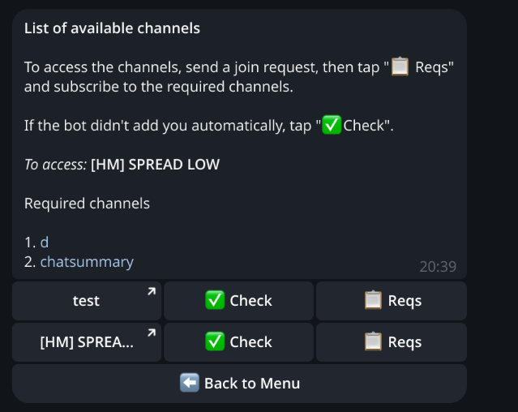

# Access Manager Bot

<p align="center">
  
</p>

<p align="center">
  <a href="https://github.com/DefaultPerson/access-manager-bot/actions/workflows/ci.yml"></a>
  <a href="LICENSE"></a>
  <a href="https://www.python.org/downloads/"></a>
  <a href="https://t.me/HMonitorsAccessBot"></a>
</p>

Telegram bot for automated access control to private channels based on subscription policies.

## Purpose

The bot governs user access to protected Telegram channels by verifying subscriptions to a set of required channels. If a user no longer meets the requirements, access is revoked automatically after a grace period.

## Features

### For users
- **Automatic access checks** — the bot tracks subscriptions and manages access in real time
- **Grace period** — 3 hours to restore subscriptions before access is revoked
- **Cascading policies** — automatic management of dependent channels
- **Interactive notifications** — buttons to subscribe and re-check status
- **Multilingual UI** — Russian, English and Ukrainian

### For administrators
- **Access policy management** — create and configure access rules
- **Required-channel registration** — define prerequisites for protected channels
- **User monitoring** — statistics and grant management
- **Manual compliance scan** — force a full re-scan of all users
- **Broadcast** — send a message to all users
- **Policy reactivation** — restore archived policies

## Commands

### User commands
- `/start` — launch the bot and open the main menu
- `/channels` — list available channels and current subscription status
- `/language` — choose interface language

### Admin commands
- `/admin_policies` — list all access policies
- `/admin_policy_create` — create a new access policy
- `/admin_policy_view` — view policy details
- `/admin_policy_add_required` — add a required channel to a policy
- `/admin_channel_remove` — remove a channel from a policy
- `/admin_compliance_scan` — run a compliance scan over all users
- `/admin_users` — manage users
- `/admin_user_sync` — sync user data
- `/broadcast` — send a broadcast message

## Architecture

### Access Policies
A policy defines:
- **Protected channel** — the channel whose access is governed
- **Required channels** — the list of channels a user must be subscribed to

### Cascading policies
If channel A is required for channel B, losing access to A automatically starts a grace period for B (preventive cascade).

### Background jobs
- **grace_expiry_watcher** — every 5 minutes, checks for expired grace periods
- **grace_restoration_watcher** — every minute, checks whether access can be restored
- **daily_compliance_scan** — daily compliance check (03:00 UTC)

## Setup

### Environment variables

Copy `.env.example` to `.env` and fill in the values.

### Docker Compose (recommended)

```bash
# Start services
docker-compose up -d

# Tail logs
docker-compose logs -f bot

# Stop services
docker-compose down
```

### Manual installation

```bash
# Install dependencies
uv sync

# Run migrations
uv run alembic upgrade head

# Start the bot
uv run python -m bot

# Compile translations
uv run pybabel compile -d bot/locales -D messages -f
```

## Database migrations

```bash
# Create a new migration
uv run alembic revision --autogenerate -m "description"

# Apply migrations
uv run alembic upgrade head

# Roll back one migration
uv run alembic downgrade -1
```

## Health check

A health endpoint is exposed at `http://localhost:8080/health`.

Response:
```json
{
  "status": "healthy",
  "redis": true,
  "postgres": true,
  "telegram": true
}
```
